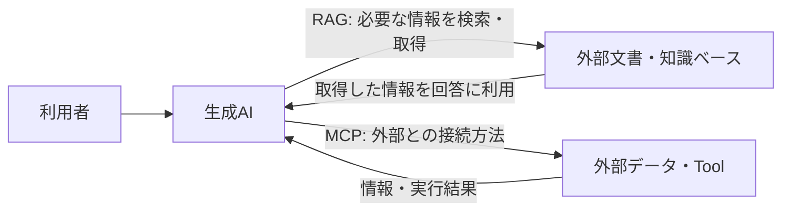

# 生成AI利用の基礎 -202608-

## Document Information（文書情報）

| Item（項目） | Value（値） |
|---|---|
| Document ID（文書ID） | SLK-01-AI-OVERVIEW |
| Version（バージョン） | 0.3 |
| Status（ステータス） | Draft |
| Created Date（作成日） | 2026-08-26 |
| Last Updated（最終更新日） | 2026-08-26 |
| Owner（管理者） | Takashi Oikawa |
| Related Documents（関連文書） | [01：AI利用の基礎](./README.md) / [生成AI利用時の安全ルール](./ai_safety_basic.md) / [生成AIへの指示方法 -202608-](./how_to_instruct_generative_ai.md) |

> 本資料は **2026年8月時点** の生成AI環境を前提とする。生成AIモデルの性能・特性は継続的に変化するため、モデルに依存する利用方法は将来変更される可能性がある。

---

## 1. Purpose（目的）

生成AIを「答えを出してくれる道具」としてだけ見るのではなく、**どのような場面で使えるか、使い方によってなぜ結果が変わるか、どこまでAIに任せ、どこを人間が判断するか**を理解する。

本資料では生成AIを利用することを前提とする。「使う / 使わない」「メリット / デメリット」という二分法を主構造にはしない。

対象はPF作成やソフトウェア開発だけではない。職業訓練校の生徒が実際に利用する、学習・就職活動・PF作成・ソフトウェア開発を主な例として扱う。

---

## 2. AIの中で生成AIを捉える

AI（Artificial Intelligence）は広い概念であり、生成AIはその中で、入力された情報をもとに文章・コード・画像などの新しい内容を生成するシステムとして扱われる。本資料ではAI全般の歴史や機械学習理論を学ぶのではなく、**現在利用している生成AIを理解して使うために必要な範囲**に絞る。[NIST](https://www.nist.gov/publications/artificial-intelligence-risk-management-framework-generative-artificial-intelligence)

現在の生成AIサービスは、単一の言語モデルだけで完結するとは限らない。言語モデルに加え、画像・音声等の入力、検索、外部Tool、外部データなどを組み合わせて提供される場合がある。

---

## 3. 生成AIは何に使えるか

生成AIは文章やコードを生成するだけのものではない。目的や状況を伝えることで、説明、整理、比較、案出し、下書き、レビュー支援などに利用できる。

代表的な利用場面は次の4つである。

| 利用場面 | 利用例 |
|---|---|
| 学習 | 分からない概念の説明、練習問題、エラー原因の整理、理解度に合わせた説明 |
| 就職活動 | 職種調査、企業研究、自己分析の整理、応募書類の下書き、面接練習 |
| PF作成 | テーマ整理、要求・要件整理、設計支援、README作成、レビュー |
| ソフトウェア開発 | 設計検討、実装案、コード説明、エラー解析、テスト観点、レビュー支援 |

このほか、調査・情報整理、文章作成、アイデア比較、フィードバックなどにも利用できる。

---

## 4. 使い方によって結果は変わる

生成AIは、利用者が十分な情報を与えなくても回答を返すことがある。しかし、判断材料が足りなければAI側の推測が増え、利用者の意図とずれる可能性が高くなる。

### 4.1 学習

| 特に意識せず使う場合 | ポイントを押さえて使う場合 |
|---|---|
| 「このエラーを教えて」とだけ聞く。 | 学習中の言語、目標、エラー内容、試したこと、どこまで理解しているかを伝える。 |
| AIが状況を推測するため、難しすぎる説明や的外れな原因になることがある。 | 自分の状況に合う説明や、次に確認すべき点を得やすくなる。 |

### 4.2 就職活動

| 特に意識せず使う場合 | ポイントを押さえて使う場合 |
|---|---|
| 「志望動機を書いて」とだけ依頼する。 | 応募先について確認できる事実、自分の経験、伝えたい点、作ってはいけない事実を伝える。 |
| もっともらしいが本人の経験ではない内容が混ざる可能性がある。 | 下書きや整理をAIに任せつつ、事実と本人らしさを人間が確認できる。 |

### 4.3 PF作成

| 特に意識せず使う場合 | ポイントを押さえて使う場合 |
|---|---|
| 「アプリを作って」と依頼する。 | 目的、利用者、必要な機能、対象範囲、守る条件、完成条件を伝える。 |
| AIが機能や技術を推測し、必要以上に大きな案を作ることがある。 | 目的に合う範囲で案を出させ、不要な機能追加を抑えやすくなる。 |

### 4.4 ソフトウェア開発

| 特に意識せず使う場合 | ポイントを押さえて使う場合 |
|---|---|
| エラーや要望だけを渡し、修正を依頼する。 | 現在の仕様、変更対象、変更禁止範囲、期待する結果、確認方法を伝える。 |
| 直したい箇所以外まで変更される可能性がある。 | 変更範囲を保ちつつ、実現方法をAIから提案させやすくなる。 |

重要なのはPromptを長くすることではない。**AIが判断するために必要な情報を与え、不要な推測を減らすこと**である。

---

## 5. どのモデルでも共通する基本

モデルの能力が違っても、次の考え方は基本的に共通する。

- 何を実現したいのかを明確にする。
- AIが判断するために必要なContextを与える。
- 守るべき重要な制約を伝える。
- 何を満たせば成功・完了なのかを示す。
- 分からない重要事項を勝手に決めさせない。
- 必要な場合は利用者へ確認させる。
- 重要な内容は人間が確認する。
- AIの回答を、そのまま事実や正解として扱わない。

---

## 6. モデルの能力によって指示の仕方は変わる

同じ生成AIでも、モデルによって指示理解、推論、長いContextの扱い、Tool利用などの能力は異なる。

本資料では便宜上、**2026年8月時点のGPT-5.x系、Claude Opus 5系、Gemini 3系後半以降の高性能モデル**を、近年の高性能モデル群として扱う。これは業界共通の世代分類を定義するものではない。

OpenAIはGPT-5.6について、Contextから利用者の意図を推定する能力が向上し、すべての手順を指定する必要がない場合がある一方、domain Context、重要な制約、承認境界、成功条件を引き続き明示するよう案内している。また、重複した指示や不要な例を減らすことで性能・Token効率が改善する場合があるとしている。[OpenAI公式](https://developers.openai.com/api/docs/guides/latest-model?model=gpt-5.6)

GoogleもGemini 3について、旧モデル向けの冗長・複雑すぎるPrompt Engineeringは過剰な分析につながる可能性があり、簡潔で明確・直接的な指示を推奨している。[Google AI公式](https://ai.google.dev/gemini-api/docs/gemini-3?hl=ja)

AnthropicもClaude Opus 5向けに、複雑なタスクでは必要な仕様・制約を与えたうえで、モデルが作業を進められる形のPrompt設計を案内している。[Anthropic公式](https://platform.claude.com/docs/ja/build-with-claude/prompt-engineering/prompting-claude-opus-5)

### 6.1 共通部分

モデルが新しくなっても、目的、必要なContext、重要な制約、成功条件、人間による確認が不要になるわけではない。

### 6.2 変わりやすい部分

| 観点 | 旧モデル・軽量モデル | 2026年8月時点の高性能モデル |
|---|---|---|
| 指示の中心 | 何をするかに加え、どう進めるかまで具体化した方が安定する場合がある。 | 何を達成したいかを明確にし、進め方には一定の自由度を与えられる。 |
| 手順 | 手順や処理順を人間が具体的に示す場面がある。 | 細かな手順を指定しすぎると、別の方法を検討する余地を狭める場合がある。 |
| Promptの詳細度 | 具体例・形式・手順を追加して意図を補う場合がある。 | 不要な重複や、結果に影響しない細かな指定を減らせる場合がある。 |
| AIに任せる範囲 | 人間が知っている進め方を示し、その通りに処理させる場面が多い。 | 目的と条件を示し、実現方法そのものをAIから提案させられる範囲が広い。 |

> **「何を実現したいか」は人間が決め、「どう実現するか」のプロセスはAIに考えさせ提案させる。**

利用者が手順を細かく固定しすぎると、AIの提案まで利用者自身の知識や経験の範囲に限定することがある。AIに一定の自由度を与えることで、利用者が知らなかった方法や、思いつかなかった選択肢が提示される可能性がある。

ただし、AIに自由度を与えることと、最終判断までAIへ委ねることは別である。**提案を確認し、採用するかどうかを決めるのは人間である。**

また、常に最新モデルを使うとは限らない。料金、利用制限、提供状況、速度、用途等によって旧モデルや軽量モデルを使う場合もある。今後登場するモデルによって、この使い分け自体が変化する可能性もある。

---

## 7. 生成AIを支える主な仕組み

生成AIとLLMは同じ意味ではない。

現在の生成AIサービスは、言語モデルを中心にしながら、画像・音声等の入力、検索、外部Tool、外部データなどを組み合わせて動作する場合がある。

### 7.1 LLMとSLM

文章を扱う中心技術として、LLM（Large Language Model：大規模言語モデル）が広く使われている。

より小規模な言語モデルはSLM（Small Language Model）と呼ばれることがある。たとえばMicrosoftはPhi Silicaを、Cloud-scale LLMより小さいParameter数で端末上の実行に最適化したSLMとして説明している。[Microsoft公式](https://learn.microsoft.com/en-us/windows/ai/apis/phi-silica-transparency-note)

ここで重要なのは名称の暗記ではない。**生成AIサービスの能力は、使用するモデルと周辺機能によって異なる**と理解することである。

### 7.2 PromptとContext

利用者がAIへ入力する質問・指示・データなどがPromptである。

AIはPromptだけを見るとは限らない。会話履歴、与えられた資料、システム側の指示、Toolから得た情報など、回答や処理の判断材料になる情報をContextとして扱う。

したがって、同じ質問でもContextが違えば回答が変わることがある。

### 7.3 Context WindowとToken

AIが一度に扱えるContextには上限がある。この範囲をContext Windowと呼ぶ。

生成AIモデルは入力・出力をTokenという単位で処理し、Context Windowの大きさもToken数で表されることがある。[Google AI公式](https://ai.google.dev/gemini-api/docs/long-context)

Context Windowが大きくても、長い情報のすべてを常に同じ精度で利用できるとは限らない。この点は後述するLITMにも関係する。

### 7.4 Multimodal

現在の生成AIには、文章だけでなく画像、音声、動画、ファイルなど複数形式の情報を扱えるものがある。Geminiの公式Documentationでも、text・video・audio・imageを扱うMultimodal利用が説明されている。[Google AI公式](https://ai.google.dev/gemini-api/docs/long-context)

### 7.5 Tool Use

生成AIは、モデル内部の知識だけで回答するのではなく、必要に応じて検索、計算、外部APIなどのToolを利用できる場合がある。

Tool Useは「AIが何でも自分で知っている」という意味ではない。外部機能を利用し、その結果を回答や処理へ使う仕組みである。[Anthropic公式](https://docs.anthropic.com/en/docs/agents-and-tools/tool-use/overview)

---

## 8. RAGとMCP

RAGとMCPはいずれも生成AIの外側にある情報・機能と関係するが、役割は同じではない。

RAG（Retrieval-Augmented Generation）は、質問に関係する外部情報を検索・取得し、その情報を使って生成する考え方である。原論文では、言語モデルの内部知識と外部のnon-parametric memoryを組み合わせる方式として提案された。[NeurIPS原論文](https://proceedings.neurips.cc/paper/2020/hash/6b493230-Abstract.html)

MCP（Model Context Protocol）は、LLMアプリケーションと外部データ・Toolを接続するためのProtocolである。[MCP公式Specification](https://modelcontextprotocol.io/specification/2026-07-28)

RAGは主に**回答に使う情報を取得する考え方**、MCPは**外部データやToolと接続するProtocol**として区別すると理解しやすい。

---

## 9. 生成AI利用時に知っておくべき特性・問題

### 9.1 Hallucination

生成AIは、事実と異なる内容をもっともらしく生成することがある。これをHallucinationと呼ぶ。

たとえば、存在しない制度、URL、Library、企業情報などを自然な文章で提示する場合がある。

対処：

- 重要な事実は公式情報や一次情報で確認する。
- AIが自信を持って書いていることを正しさの根拠にしない。
- 最新情報が必要な場合は検索や一次情報を利用する。

OpenAIもGPT-5系でHallucinationを評価対象としており、低減はしてもゼロになったとはしていない。[OpenAI公式](https://deploymentsafety.openai.com/gpt-5)

### 9.2 LITM（Lost in the Middle）

長いContextでは、重要な情報の位置によって利用のされ方が変わることがある。LITM研究では、長い入力の中間に置かれた関連情報を利用する性能が低下する傾向が報告されている。[TACL原論文](https://direct.mit.edu/tacl/article/doi/10.1162/tacl_a_00638/119630/Lost-in-the-Middle-How-Language-Models-Use-Long)

対処：

- 重要な条件を必要な時点で再提示する。
- 確定事項を文書に残す。
- 長い会話ではContextを整理する。
- 「前に伝えたから必ず使われる」と考えない。

詳しくは [LITMと文脈管理](./litm_and_context_management.md) を参照する。

### 9.3 迎合

生成AIが利用者の主張や好みに合わせすぎ、必要な反論や訂正を弱めるような出力をすることがある。Anthropicの研究では、利用者の信念に合う回答をTruthfulな回答より選びやすいSycophancyが確認されている。[Anthropic Research](https://www.anthropic.com/research/towards-understanding-sycophancy-in-language-models)

対処：

- 賛成だけではなく、問題点や反論も求める。
- 事実・正本・Evidenceと照合する。
- 重要な判断は別の視点やReviewでも確認する。

詳しくは [生成AIの迎合と摩擦回避 詳細編](./generative_ai_sycophancy_detail.md) を参照する。

### 9.4 自己正当化に見える出力

本教材では、生成AIが過去の誤回答を明確に撤回せず、後付けの理由や一般論を追加して維持するように見える出力を、運用上「自己正当化バイアス」と呼ぶ。

これはAIに自尊心や感情があるという意味ではない。本教材で扱うのは、利用者が外部から確認できる出力傾向である。

AI自身に「もう一度見直して」と依頼するだけで十分とは限らない。LLMの自己訂正研究でも、外部Feedbackなしの自己訂正には限界があることが報告されている。[TACL](https://aclanthology.org/2024.tacl-1.27/)

対処：

- 過去の回答ではなく、正本や一次情報と照合する。
- 誤りなら明確に撤回させる。
- 必要に応じて別のAIや人間による独立Reviewを利用する。

詳しくは [生成AIの自己正当化バイアス 詳細編](./self_justification_bias_detail.md) を参照する。

---

## 10. 上手に使うための方法：ASKME

AIに自由度を与えることは、分からないことまでAIに勝手に決めさせることではない。

重要な条件が未確定で、その判断によって結果が大きく変わる場合は、AIから利用者へ質問させる。OpenAIのGPT-5.6向けガイダンスでも、重要な曖昧さがある場合に質問させる境界を示すことが案内されている。[OpenAI公式](https://developers.openai.com/api/docs/guides/latest-model?model=gpt-5.6)

本教材ではこの使い方を **ASKME** と呼ぶ。

例：

> 判断に必要な情報が不足している場合は、推測で補完せず、必要な未確定事項だけ質問してください。判断に影響しない細部は合理的に処理して続行してください。

ASKMEの目的は質問を増やすことではない。**利用者が決めるべき事項だけを確認し、それ以外では作業を止めないこと**である。

---

## 11. AIと人間の役割

AIを使うことで人間の判断が不要になるわけではない。役割が変わる。

| 人間が担うこと | AIに任せやすいこと |
|---|---|
| 何を実現したいかを決める | 実現方法を考え、複数案を提案する |
| 重要な制約・守る条件を決める | 情報を整理し、比較する |
| 事実やEvidenceを確認する | 説明、下書き、要約を作る |
| 提案を採用するか判断する | 問題点や抜け漏れを探す支援をする |
| 安全性・責任を伴う最終判断を行う | Test観点やReview観点を提案する |

基本の流れは次のとおりである。

1. **人間：何を実現したいかを決める。**
2. **AI：どう実現するかのプロセスを考え、提案する。**
3. **人間：提案を確認し、採用するか判断する。**

---

## 12. 次に読む資料

この資料で全体像を理解した後は、次の順で確認する。

1. [生成AI利用時の安全ルール](./ai_safety_basic.md)
2. [生成AIへの指示方法 -202608-](./how_to_instruct_generative_ai.md)

LITM、迎合、自己正当化をより詳しく理解したい場合は、`[発展]` の詳細資料を参照する。

長い作業を新しいChatへ引き継ぐ必要がある場合は、`[補助資料]` の [AI専用・新チャット文脈移行プロトコル -202608-](./migration_context_template.md) を利用する。

---

## 13. Evidence

- **EV-001**：[OpenAI — Model guidance: Using GPT-5.6](https://developers.openai.com/api/docs/guides/latest-model?model=gpt-5.6)
- **EV-002**：[Google — Gemini 3 developer guide](https://ai.google.dev/gemini-api/docs/gemini-3?hl=ja)
- **EV-003**：[Anthropic — Prompting Claude Opus 5](https://platform.claude.com/docs/ja/build-with-claude/prompt-engineering/prompting-claude-opus-5)
- **EV-017**：[Model Context Protocol Specification 2026-07-28](https://modelcontextprotocol.io/specification/2026-07-28)
- **EV-005**：[Lost in the Middle: How Language Models Use Long Contexts](https://direct.mit.edu/tacl/article/doi/10.1162/tacl_a_00638/119630/Lost-in-the-Middle-How-Language-Models-Use-Long)
- **EV-006**：[Retrieval-Augmented Generation for Knowledge-Intensive NLP Tasks](https://proceedings.neurips.cc/paper/2020/hash/6b493230-Abstract.html)
- **EV-007**：[Anthropic — Towards Understanding Sycophancy in Language Models](https://www.anthropic.com/research/towards-understanding-sycophancy-in-language-models)
- **EV-008**：[Automatically Correcting Large Language Models](https://aclanthology.org/2024.tacl-1.27/)
- **EV-009**：[OpenAI — GPT-5 System Card](https://deploymentsafety.openai.com/gpt-5)
- **EV-010**：[Anthropic — Tool use with Claude](https://docs.anthropic.com/en/docs/agents-and-tools/tool-use/overview)
- **EV-011**：[NIST — Artificial Intelligence Risk Management Framework: Generative Artificial Intelligence Profile](https://www.nist.gov/publications/artificial-intelligence-risk-management-framework-generative-artificial-intelligence)
- **EV-015**：[Google — Long context](https://ai.google.dev/gemini-api/docs/long-context)
- **EV-016**：[Microsoft — Transparency Note: Phi Silica](https://learn.microsoft.com/en-us/windows/ai/apis/phi-silica-transparency-note)

Repository全体のEvidence一覧は [EVIDENCE.md](../EVIDENCE.md) を参照する。
