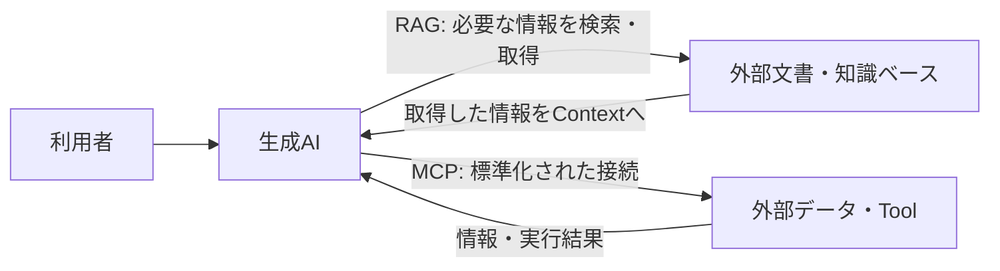

# 生成AI利用の基礎 -202608-

## Document Information（文書情報）

| Item（項目） | Value（値） |
|---|---|
| Document ID（文書ID） | SLK-01-AI-OVERVIEW |
| Version（バージョン） | 0.1 |
| Status（ステータス） | Draft |
| Created Date（作成日） | 2026-08-26 |
| Last Updated（最終更新日） | 2026-08-26 |
| Owner（管理者） | Takashi Oikawa |
| Related Documents（関連文書） | [01：AI利用の基礎](./README.md) / [生成AI利用時の安全ルール](./ai_safety_basic.md) / [生成AIへの指示方法](./how_to_instruct_generative_ai.md) |

> 本資料は **2026年8月時点** の生成AI環境を前提とする。生成AIモデルの性能・特性は継続的に変化するため、モデルに依存する利用方法は将来変更される可能性がある。

---

## 1. Purpose（目的）

生成AIを「答えを出してくれる道具」としてだけ見るのではなく、どのような場面で使え、使い方によって結果がなぜ変わるのかを理解する。

本資料では、生成AIを利用することを前提とする。「使う / 使わない」「メリット / デメリット」という二分法ではなく、**どのように使うと結果が変わるのか、何をAIに任せ、何を人間が判断するのか**を中心に扱う。

対象はPF作成やソフトウェア開発だけではない。職業訓練校の生徒が実際に利用する、学習・就職活動・PF作成・開発を主な例として説明する。

---

## 2. 生成AIは何に使えるか

生成AIは、文章やコードを生成するだけのものではない。利用者が目的や状況を伝えることで、説明、整理、比較、案出し、下書き、レビュー支援などに利用できる。

代表的な利用場面は次の4つである。

| 利用場面 | 利用例 |
|---|---|
| 学習 | 分からない概念の説明、練習問題、エラー原因の整理、理解度に合わせた説明 |
| 就職活動 | 職種調査、企業研究、自己分析の整理、応募書類の下書き、面接練習 |
| PF作成 | テーマ整理、要求・要件整理、設計支援、README作成、レビュー |
| ソフトウェア開発 | 設計検討、実装案、コード説明、エラー解析、テスト観点、レビュー支援 |

このほか、調査・情報整理、文章作成、アイデア比較、フィードバックなどにも利用できる。

---

## 3. 使い方によって結果は変わる

生成AIは、利用者が十分な情報を与えなくても何らかの回答を返すことがある。しかし、その場合はAI側の推測が増え、利用者の意図とずれる可能性が高くなる。

### 3.1 学習

| 特に意識せず使う場合 | ポイントを押さえて使う場合 |
|---|---|
| 「このエラーを教えて」とだけ聞く。 | 学習中の言語、目標、エラー内容、試したこと、どこまで理解しているかを伝える。 |
| AIは状況を推測して説明するため、難しすぎる説明や的外れな原因になることがある。 | 自分の状況に合わせた説明や、次に確認すべき点を得やすくなる。 |

### 3.2 就職活動

| 特に意識せず使う場合 | ポイントを押さえて使う場合 |
|---|---|
| 「志望動機を書いて」とだけ依頼する。 | 応募先の事実、自分の経験、伝えたい点、作ってはいけない事実を伝える。 |
| もっともらしいが本人の経験ではない内容が混ざる可能性がある。 | 下書きや整理をAIに任せつつ、事実と本人らしさを人間が確認できる。 |

### 3.3 PF作成

| 特に意識せず使う場合 | ポイントを押さえて使う場合 |
|---|---|
| 「アプリを作って」と依頼する。 | 目的、利用者、必要な機能、対象範囲、守る条件、完成条件を伝える。 |
| AIが機能や技術を推測して、必要以上に大きな案を作ることがある。 | 目的に合う範囲で案を出させ、不要な機能追加を抑えやすくなる。 |

### 3.4 ソフトウェア開発

| 特に意識せず使う場合 | ポイントを押さえて使う場合 |
|---|---|
| エラーや要望だけを渡し、修正を依頼する。 | 現在の仕様、変更対象、変更禁止範囲、期待する結果、確認方法を伝える。 |
| 直したい箇所以外まで変更される可能性がある。 | 変更範囲を保ちつつ、実現方法をAIから提案させやすくなる。 |

重要なのはPromptを長くすることではない。**AIが判断するために必要な情報を与え、不要な推測を減らすこと**である。

---

## 4. どのモデルでも共通する基本

モデルの能力が違っても、次の考え方は基本的に共通する。

- 何をしたいのかを明確にする。
- AIが判断するために必要なContextを与える。
- 守るべき重要な制約を伝える。
- 分からないことを勝手に決めさせない。
- 必要な場合は利用者へ確認させる。
- 重要な内容は人間が確認する。
- AIの回答を、そのまま事実や正解として扱わない。

---

## 5. モデルの能力によって指示の仕方は変わる

同じ生成AIでも、旧モデル・軽量モデルと近年の高性能モデルでは、指示理解、推論、長いContextの扱い、Tool利用などの能力が異なる。

2026年8月時点では、OpenAIはGPT-5.5について、期待する結果・成功条件・制約を示し、不要なstep-by-step指示を減らしてモデルが解決経路を選べるようにする方向を案内している。[OpenAI公式](https://developers.openai.com/api/docs/guides/latest-model?model=gpt-5.5)

GoogleもGemini 3について、古いモデル向けの冗長・複雑なPrompt Engineeringが過剰分析につながる可能性を示し、簡潔で明確な指示を推奨している。[Google AI公式](https://ai.google.dev/gemini-api/docs/gemini-3?hl=ja)

AnthropicのClaude Opus 5向けガイドでも、複雑なタスクでは完全なタスク仕様を与えたうえで実行を任せることや、旧モデル向けの過剰な検証指示が不要になる場合があることが説明されている。[Anthropic公式](https://platform.claude.com/docs/ja/build-with-claude/prompt-engineering/prompting-claude-opus-5)

### 5.1 共通部分

目的、必要なContext、重要な制約、人間による確認は、モデルが新しくなっても不要になるわけではない。

### 5.2 変わりやすい部分

| 観点 | 旧モデル・軽量モデル | 2026年8月時点の高性能モデル |
|---|---|---|
| 指示の中心 | 何をするかに加え、どう進めるかまで具体化した方が安定する場合がある。 | 何を達成したいかを明確にし、進め方には一定の自由度を与えられる。 |
| 手順 | 手順や処理順を人間が具体的に示す場面が多い。 | 細かな手順を指定しすぎると、モデルが別の方法を検討する余地を狭める場合がある。 |
| Promptの詳細度 | 具体例・形式・手順を追加して意図を補う場合がある。 | 不要な重複や、結果に影響しない細かな指定を減らせる場合がある。 |
| AIに任せる範囲 | 人間が知っている進め方を示し、その通りに処理させる場面が多い。 | 目的と条件を示し、実現方法そのものをAIから提案させられる範囲が広い。 |

> **「何を実現したいか」は人間が決め、「どう実現するか」のプロセスはAIに考えさせ提案させる。**

利用者が手順を細かく固定しすぎると、AIの考え方まで利用者自身の知識や経験の範囲に限定することがある。AIに一定の自由度を与えることで、利用者が知らなかった方法や、思いつかなかった選択肢が提示される可能性がある。

ただし、AIに自由度を与えることと、最終判断までAIへ委ねることは別である。AIが提案した内容を採用するかどうかは人間が判断する。

また、旧モデルや軽量モデルを利用することは珍しくない。料金、利用制限、提供状況、速度、用途などによって、適切なモデルは変わる。今後登場するモデルによって、この使い分け自体が変化する可能性もある。

---

## 6. 生成AIを支える主な仕組み

生成AIはLLMそのものと同じ意味ではない。

現在の生成AIサービスは、言語モデルを中心にしながら、画像・音声などの入力、検索、外部Tool、外部データなどを組み合わせて動作する場合がある。

### 6.1 LLMとSLM

文章を理解・生成する中心技術として、LLM（Large Language Model：大規模言語モデル）が広く使われている。

LLMより小規模な言語モデルはSLM（Small Language Model）と呼ばれることがある。LLMとSLMの境界は一つの固定値で決まるものではなく、用途やモデル設計によって位置づけが異なる。

重要なのは名称を覚えることではなく、**生成AIサービスの能力は、使用しているモデルや周辺機能によって異なる**と理解することである。

### 6.2 PromptとContext

利用者がAIへ入力する質問・指示・データなどがPromptである。

AIはそのPromptだけを見るとは限らない。会話履歴、与えられた資料、システム側の指示、Toolから得た情報など、回答の判断材料になる情報をContextとして扱う。

つまり、同じ質問でもContextが違えば回答が変わる可能性がある。

### 6.3 Context WindowとToken

AIが一度に扱えるContextには上限がある。この範囲をContext Windowと呼ぶ。

文章はモデル内部ではTokenという単位に分けて扱われる。Context Windowの大きさはToken数などで表されることが多い。

Context Windowが大きくても、長い情報のすべてを常に同じ精度で利用できるとは限らない。この点は後述するLITMにも関係する。

### 6.4 Multimodal

現在の生成AIには、文章だけでなく画像、音声、動画、ファイルなど複数形式の情報を扱えるものがある。このように複数の種類の情報を扱う性質をMultimodalと呼ぶ。

### 6.5 Tool Use

生成AIは、モデル内部の知識だけで回答するのではなく、必要に応じて検索、計算、外部APIなどのToolを利用できる場合がある。

Tool Useは「AIが何でも自分で知っている」という意味ではない。外部機能を利用し、その結果をContextとして回答や処理に使う仕組みである。[Anthropic公式](https://docs.anthropic.com/en/docs/agents-and-tools/tool-use/overview)

---

## 7. RAGとMCP

RAGとMCPはいずれも生成AIの外側にある情報・機能と関係するが、役割は同じではない。

RAG（Retrieval-Augmented Generation）は、質問に関係する外部情報を検索・取得し、その情報を使って生成する考え方である。原論文では、言語モデルのparametric memoryと外部のnon-parametric memoryを組み合わせる方式として提案された。[NeurIPS原論文](https://proceedings.neurips.cc/paper/2020/hash/6b493230-Abstract.html)

MCP（Model Context Protocol）は、LLMアプリケーションと外部データ・Toolを接続するための標準化されたProtocolである。[MCP公式Specification](https://modelcontextprotocol.io/specification/2025-11-25)

RAGは主に**回答に使う情報を取得する考え方**、MCPは**外部データやToolと接続するためのProtocol**として区別すると理解しやすい。

---

## 8. 生成AI利用時に知っておくべき特性・問題

### 8.1 Hallucination

生成AIは、事実と異なる内容をもっともらしく生成することがある。これをHallucinationと呼ぶ。

たとえば、存在しない制度、URL、ライブラリ、企業情報などを自然な文章で提示する場合がある。

対処：

- 重要な事実は公式情報や一次情報で確認する。
- 「AIが自信を持って書いている」ことを正しさの根拠にしない。
- 最新情報が必要な場合は検索や一次情報を利用する。

OpenAIもGPT-5でHallucination低減を評価対象としており、低減はしてもゼロになったとはしていない。[OpenAI公式](https://deploymentsafety.openai.com/gpt-5)

### 8.2 LITM（Lost in the Middle）

長いContextでは、重要な情報の位置によって利用のされ方が変わることがある。LITM研究では、長い入力の中間に置かれた関連情報を利用する性能が低下する傾向が報告されている。[TACL原論文](https://direct.mit.edu/tacl/article/doi/10.1162/tacl_a_00638/119630/Lost-in-the-Middle-How-Language-Models-Use-Long)

対処：

- 重要な条件を必要な時点で再提示する。
- 確定事項を文書に残す。
- 長い会話ではContextを整理する。
- 「前に伝えたから必ず使われる」と考えない。

詳しくは [LITMと文脈管理](./litm_and_context_management.md) を参照する。

### 8.3 迎合

生成AIが利用者の主張や好みに合わせすぎ、必要な反論や訂正を弱めるような出力をすることがある。研究では、利用者の信念に合う回答をTruthfulな回答より選びやすいSycophancyが確認されている。[Anthropic Research](https://www.anthropic.com/research/towards-understanding-sycophancy-in-language-models)

対処：

- 「賛成してほしい」のではなく、問題点や反論も求める。
- 事実・正本・Evidenceと照合する。
- 重要な判断は別の視点やレビューでも確認する。

詳しくは [生成AIの迎合と摩擦回避 詳細編](./generative_ai_sycophancy_detail.md) を参照する。

### 8.4 自己正当化に見える出力

本教材では、生成AIが過去の誤回答を明確に撤回せず、後付けの理由や一般論を追加して維持するように見える出力を、運用上「自己正当化バイアス」と呼ぶ。

これはAIに自尊心や感情があるという意味ではない。本教材で扱うのは、利用者が外部から確認できる出力傾向である。

AI自身に「もう一度見直して」と依頼するだけで十分とは限らない。LLMの自己訂正研究でも、外部Feedbackなしの自己訂正には限界があることが報告されている。[TACL](https://aclanthology.org/2024.tacl-1.27/)

対処：

- 過去の回答ではなく、正本や一次情報と照合する。
- 誤りなら明確に撤回させる。
- 必要に応じて別のAIや人間による独立レビューを利用する。

詳しくは [生成AIの自己正当化バイアス 詳細編](./self_justification_bias_detail.md) を参照する。

---

## 9. 上手に使うための方法：ASKME

AIに自由度を与えることは、分からないことまでAIに勝手に決めさせることではない。

重要な条件が未確定で、その判断によって結果が大きく変わる場合は、AIから利用者へ質問させる。

本教材ではこの使い方を **ASKME** と呼ぶ。

例：

> 判断に必要な情報が不足している場合は、推測で補完せず、必要な未確定事項だけ質問してください。判断に影響しない細部は合理的に処理して続行してください。

ASKMEの目的は質問を増やすことではない。**利用者が決めるべき事項だけを確認し、それ以外では作業を止めないこと**である。

---

## 10. AIと人間の役割

AIを使うことで人間の判断が不要になるわけではない。役割が変わる。

| 人間が担うこと | AIに任せやすいこと |
|---|---|
| 何を実現したいかを決める | 実現方法を考え、複数案を提案する |
| 重要な制約・守る条件を決める | 情報を整理し、比較する |
| 事実やEvidenceを確認する | 説明、下書き、要約を作る |
| 提案を採用するか判断する | 問題点や抜け漏れを探す支援をする |
| 安全性・責任を伴う最終判断を行う | テスト観点やレビュー観点を提案する |

基本の流れは次のとおりである。

1. **人間：何を実現したいかを決める。**
2. **AI：どう実現するかのプロセスを考え、提案する。**
3. **人間：提案を確認し、採用するか判断する。**

---

## 11. 次に読む資料

この資料で全体像を理解した後は、次の順で確認する。

1. [生成AI利用時の安全ルール](./ai_safety_basic.md)
2. [生成AIへの指示方法](./how_to_instruct_generative_ai.md)

LITM、迎合、自己正当化をより詳しく理解したい場合は、`[発展]` の詳細資料を参照する。

長い作業を新しいチャットへ引き継ぐ必要がある場合は、`[補助資料]` の [AI専用・新チャット文脈移行プロトコル](./migration_context_template.md) を利用する。

---

## 12. Evidence

- **EV-001**：[OpenAI — Model guidance: Using GPT-5.5](https://developers.openai.com/api/docs/guides/latest-model?model=gpt-5.5)
- **EV-002**：[Google — Gemini 3 developer guide](https://ai.google.dev/gemini-api/docs/gemini-3?hl=ja)
- **EV-003**：[Anthropic — Prompting Claude Opus 5](https://platform.claude.com/docs/ja/build-with-claude/prompt-engineering/prompting-claude-opus-5)
- **EV-004**：[Model Context Protocol Specification](https://modelcontextprotocol.io/specification/2025-11-25)
- **EV-005**：[Lost in the Middle: How Language Models Use Long Contexts](https://direct.mit.edu/tacl/article/doi/10.1162/tacl_a_00638/119630/Lost-in-the-Middle-How-Language-Models-Use-Long)
- **EV-006**：[Retrieval-Augmented Generation for Knowledge-Intensive NLP Tasks](https://proceedings.neurips.cc/paper/2020/hash/6b493230-Abstract.html)
- **EV-007**：[Anthropic — Towards Understanding Sycophancy in Language Models](https://www.anthropic.com/research/towards-understanding-sycophancy-in-language-models)
- **EV-008**：[Automatically Correcting Large Language Models](https://aclanthology.org/2024.tacl-1.27/)
- **EV-009**：[OpenAI — GPT-5 System Card](https://deploymentsafety.openai.com/gpt-5)
- **EV-010**：[Anthropic — Tool use with Claude](https://docs.anthropic.com/en/docs/agents-and-tools/tool-use/overview)

Repository全体のEvidence一覧は [EVIDENCE.md](../EVIDENCE.md) を参照する。
